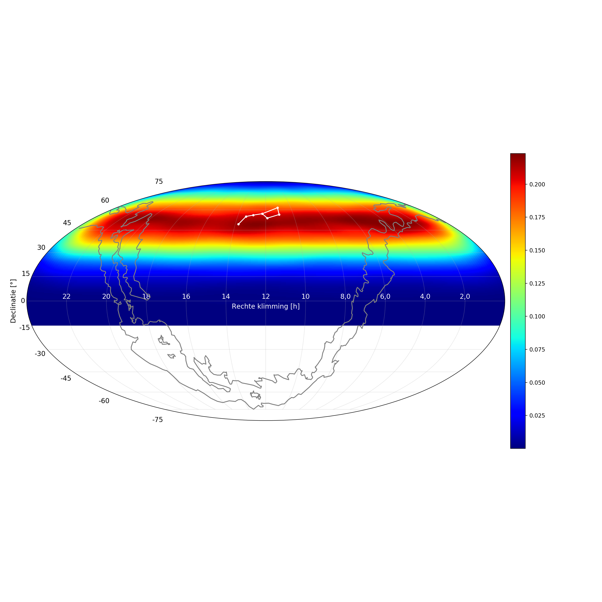

# Onderzoeken 4 - HiSPARC
Dit is de Python code welke gebruikt is bij het van Onderzoeken 4.
Hierbij word er gebruik gemaakt van Jupyter Notebook.
Het hoofdonderdeel van de code is [dit bestand](main.ipynb), de rest van de mappen dient als werkomgeving.

## Onderzoeksvraag
Kunnen de [i]ultrahigh-energy[/i] deeltjes afkomstig van de Grote Beer worden waargenomen met HiSPARC?

## Verkregen resultaten
De volgende resultaten zijn verkregen:

